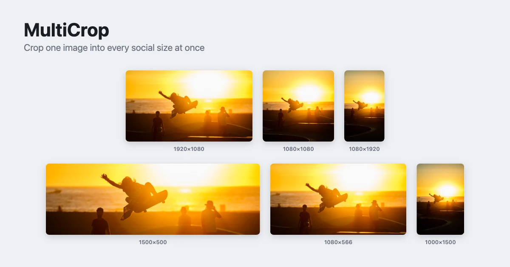

# Multi-Crop Starter Kit

Crop a single image into every social-media size at once. Upload one photo, pick the platforms you need, and MultiCrop generates subject-aware crops for each format — then lets you fine-tune any crop and download them all as a ZIP. Built with [CE.SDK](https://img.ly/creative-sdk) by [IMG.LY](https://img.ly), runs entirely in the browser with no server dependencies.

<p>
  <a href="https://img.ly/docs/cesdk/">Documentation</a>
</p>



## How It Works

1. **Upload** an image (or use the bundled sample).
2. **Pick sizes** — tick one or more social formats, grouped by platform.
3. **Generate** — each crop is produced headlessly and framed around the image's focal point.
4. **Review** the gallery of generated crops.
5. **Edit** any crop in a focused, crop-only editor (resizable, ratio-locked frame).
6. **Download all** crops as a single ZIP.

## Getting Started

### Clone the Repository

```bash
git clone https://github.com/imgly/starterkit-multi-crop-ts-web.git
cd starterkit-multi-crop-ts-web
```

### Install Dependencies

```bash
npm install
```

> CE.SDK engine assets and the background-removal model stream from the IMG.LY CDN on first use — there is no separate asset-download step.

### Set Your License Key (optional)

```bash
cp .env.example .env.local
# then edit .env.local and set VITE_CESDK_LICENSE
```

Without a key the app still runs; exports carry an evaluation watermark. Get a free trial key at [img.ly/forms/free-trial](https://img.ly/forms/free-trial).

### Run the Development Server

```bash
npm run dev
```

Open `http://localhost:5173` in your browser.

## Configuration

### License Key

The key is read from Vite's build-time env (`VITE_CESDK_LICENSE`) in [`src/app/license.ts`](src/app/license.ts) and passed to both engines. When absent, the engines run unlicensed (watermarked) and the demo still works.

### Which Presets Appear

Sizes come from CE.SDK's built-in `ly.img.page.presets` asset source. [`src/app/presets.ts`](src/app/presets.ts) keeps only the social-media groups (Instagram, Facebook, TikTok, YouTube, LinkedIn, X, Pinterest) and skips print/video. Edit `GROUP_TO_CATEGORY` and `CATEGORY_ORDER` to change which platforms show and in what order.

### Subject-Aware Cropping

Each crop is framed around a focal point computed in [`src/app/saliency.ts`](src/app/saliency.ts), which runs `@imgly/background-removal` and takes the alpha-mask centroid (biased toward the subject's head). This pulls in `onnxruntime-web` (a ~24 MB WASM model). If you don't need subject-aware framing, drop those two dependencies — the crop builder accepts a `null` focal point and centers geometrically with no model involved.

## Architecture

Two CE.SDK engines drive a vanilla-TypeScript DOM shell — **one scene per preset**:

- A **headless `@cesdk/engine`** is the only thing that produces pixels: it builds a crop scene per preset and exports PNGs.
- A single **hidden `@cesdk/cesdk-js`** editor, created once and reused, hosts the crop-only modal and the preset catalog.
- The **source of truth** for each crop is its serialized scene string; thumbnails are derived re-renders.

```
starterkit-multi-crop-ts-web/
├── index.html                  # App shell markup + all styling (light theme)
├── src/
│   ├── index.ts                # Orchestrator: owns state, wires shell ↔ renderer ↔ editor
│   └── app/
│       ├── state.ts            # In-memory app state + thumbnail-URL lifecycle
│       ├── presets.ts          # Loads social-media page presets, grouped by platform
│       ├── saliency.ts         # Focal-point detection (bg-removal alpha centroid + head bias)
│       ├── scene.ts            # Builds a per-preset crop scene (the page IS the crop)
│       ├── renderer.ts         # Headless engine: generate crops, export PNGs (serialized)
│       ├── crop-editor-config.ts # Strips the editor down to crop-only
│       ├── editor.ts           # CropEditor: the reusable, hidden crop modal
│       ├── ui.ts               # DOM rendering (size cards, gallery, spinner)
│       ├── download.ts         # Re-renders every crop → one ZIP
│       └── license.ts          # Reads the CE.SDK license from the Vite env
├── public/                     # Bundled sample image
├── package.json
└── vite.config.ts
```

## Key Capabilities

- **Batch cropping** – one image → many social formats in a single pass
- **Subject-aware framing** – focal-point detection keeps faces/subjects in frame
- **Headless export** – a dedicated `CreativeEngine` renders crops to PNG with no visible canvas
- **Crop-only editor** – re-frame any crop with a resizable, aspect-locked frame
- **ZIP download** – every crop re-rendered from its canonical scene and bundled
- **No framework** – pure TypeScript + Vite, runs entirely client-side

## Prerequisites

- **Node.js v20+** with npm – [Download](https://nodejs.org/)
- **Supported browsers** – Chrome 114+, Edge 114+, Firefox 115+, Safari 16.4+ (WebGL2 is required for the editor canvas; WebGPU, when available, accelerates background removal)

## Troubleshooting

| Issue | Solution |
|-------|----------|
| Slow on the very first load | Engine assets and the ~24 MB background-removal model download once from the IMG.LY CDN, then cache. Subsequent loads are fast. |
| Exports show a watermark | No license key set — add `VITE_CESDK_LICENSE` to `.env.local` (see Configuration). |
| "Evaluation Purposes Only" in the console | Expected without a license key. |
| Crops aren't subject-aware | Background removal returned a degenerate mask (no clear subject); the crop falls back to geometric centering. |

## Documentation

- [Crop & Transform](https://img.ly/docs/cesdk/js/edit-image/transform/crop-f67a47/)
- [Asset Sources](https://img.ly/docs/cesdk/js/asset-management/overview/)
- [Headless export to PNG](https://img.ly/docs/cesdk/node/conversion/to-png-f1660c/)
- [Background Removal](https://www.npmjs.com/package/@imgly/background-removal)

## License

This project is licensed under the MIT License - see the [LICENSE](LICENSE) file for details.

---

<p align="center">Built with <a href="https://img.ly/creative-sdk?utm_source=github&utm_medium=project&utm_campaign=starterkit-multi-crop">CE.SDK</a> by <a href="https://img.ly?utm_source=github&utm_medium=project&utm_campaign=starterkit-multi-crop">IMG.LY</a></p>
